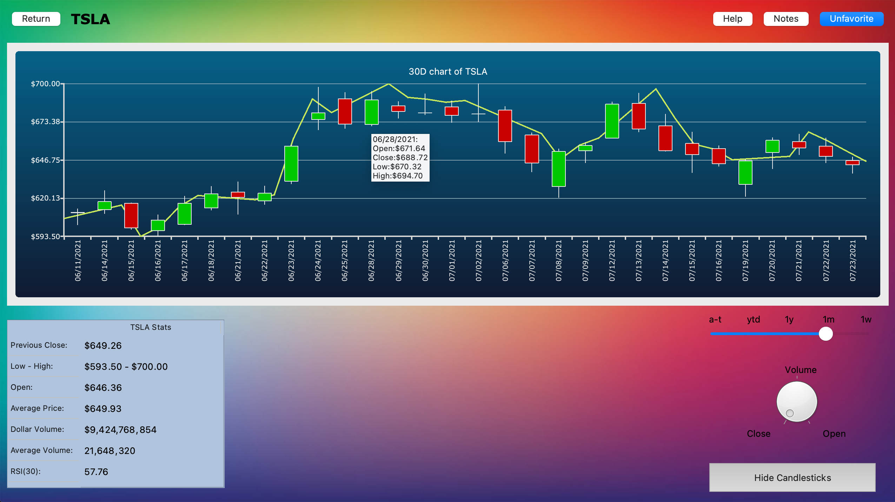

# ExchangeBuddy


<!-- PROJECT LOGO -->
<br />
<p align="center">
  <a href="https://github.com/saadxan/ExchangeBuddy/">
    
  </a>
  <p align="center">
    An interactive smart stock-analyzing application.
    <br />
    <a href="https://github.com/saadxan/ExchangeBuddy/README.md">
    <br />
    <br />
    <a href="https://github.com/saadxan/ExchangeBuddy/README.md">View Demo</a>
    ·
    <a href="https://github.com/saadxan/ExchangeBuddy/issues">Report Bug</a>
    ·
    <a href="https://github.com/saadxan/ExchangeBuddy/issues">Request Feature</a>
  </p>
</p>


<!-- TABLE OF CONTENTS -->
<details open="open">
  <summary>Table of Contents</summary>
  <ol>
    <li>
      <a href="#about-the-project">About The Project</a>
      <ul>
        <li><a href="#created-with">Created With</a></li>
      </ul>
    </li>
    <li>
      <a href="#getting-started">Getting Started</a>
      <ul>
        <li><a href="#dependencies">Dependencies</a></li>
        <li><a href="#installation">Installation</a></li>
      </ul>
    </li>
    <li><a href="#contributing">Contributing</a></li>
    <li><a href="#license">License</a></li>
    <li><a href="#acknowledgements">Acknowledgements</a></li>
  </ol>
</details>


<!-- ABOUT THE PROJECT -->
## About The Project



An application that visualizes stock price movements and provides vital analytical data to lead to smart-minded investment decisions.

Features:
* Provides the ability to inquiry any ticker on New York Stock Exchange and NASDAQ.
* Interactive tools to manipulate historical chart by period (1 week, 1 month, 1 year, year-to-date, and all-time) or by data-points (open price, close price, volume)
* 
* Lorem ipsum dolor sit amet, consectetur adipiscing elit.


### Created With

Here are the languages, tools, and frameworks used for the project.
* [Python](https://www.python.org/)
* [PyQt5](https://pypi.org/project/PyQt5/)
* [yfinance](https://finance.yahoo.com/)
* [pandas](https://pandas.pydata.org/)
* [CSS](https://www.w3.org/CSS/)


<!-- GETTING STARTED -->
## Getting Started

Few instructions on how to set up the configurations for this project.

### Dependencies

Here are the specific depencies for the project.

- python 3.9+
- PyQt 5.14.4+
- pandas 1.3.0+
- yfinance 0.1.62+

### Installation

1. The dependencies can installed w/ the Homebrew and pip package managers
   ```
   brew install python3
   ```
   ```
   brew install pip
   ```
   ```
   pip install PyQt5
   ```
   ```
   pip install pandas
   ```
   ```
   pip install yfinance
   ```
2. Clone the repo
   ```
   git clone https://github.com/saadxan/ExchangeBuddy.git
   ```
3. Run
   ```
   python3.9 main.py
   ```


<!-- CONTRIBUTING -->
## Contributing

Contributions are integral to the open source community and are the reasons why it's so awesome. If you would like to contribute to this project, you can by: 

1. Fork the Project
2. Create a Feature Branch `git checkout -b new-feature`
3. Add files `git add .`
4. Commit Changes `git commit -m 'msg'`
5. Push to Origin `git push -u origin new-feature`
6. Open a Pull Request


<!-- LICENSE -->
## License

Distributed under the !!! License. See `!!!` for more information.


<!-- ACKNOWLEDGEMENTS -->
## Acknowledgements

* [Example](https://www.example.com)
